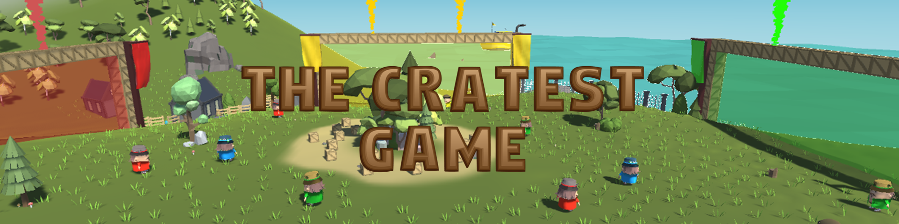
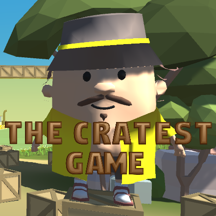
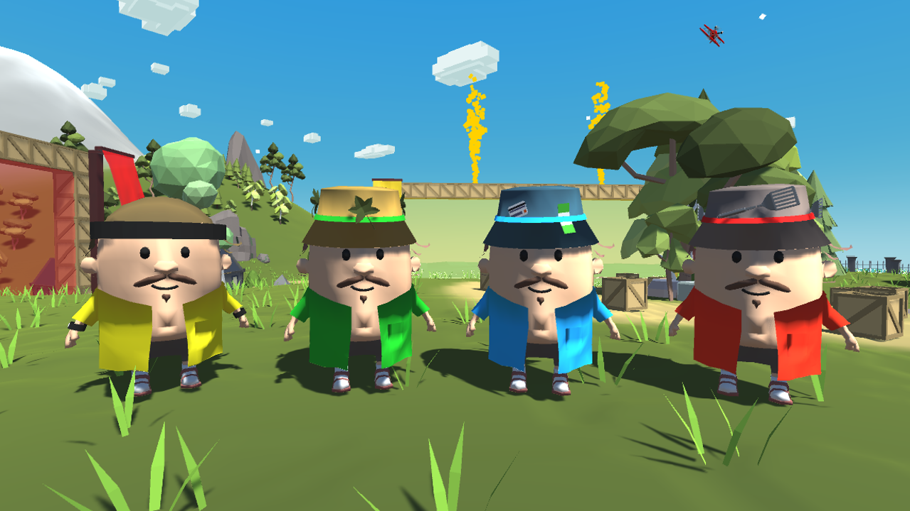
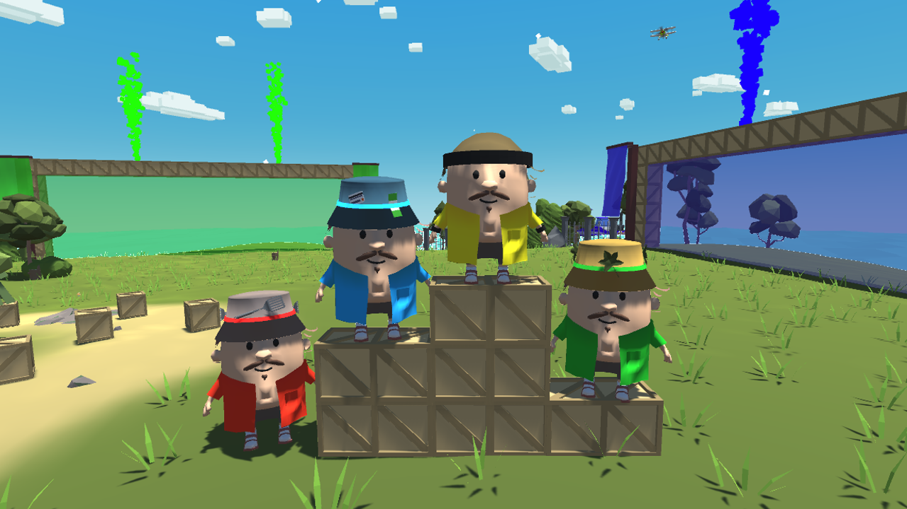
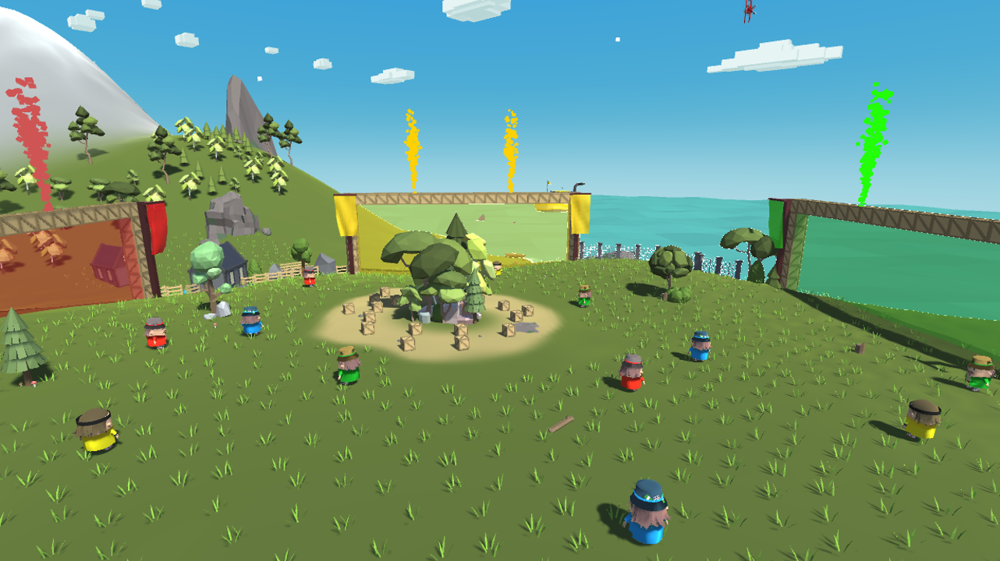

## The project 🚀
The concept of the game is inspired by UTC’s most famous event of new students’ integration activities : the battle in the forest. It is a great moment where 4 clans are split over a large field in a forest. Each player has a ribbon attached to its thigh and the goal is simple : collect the largest number of opponent's ribbons to win the round.

I got the idea of this game when those integration activities turned online due to covid. I felt sad for new students because they would not know and live this iconic moment. In that way I wanted to translate it into an online multiplayer game, inspired by party-games such as Mario Party or Fall Guys.

The game takes place on an island surrounded by water. The center of the island is filled with crates and each team has its portal to bring crates back. Every player has a gem in its back (it embodies the ribbon), and when a player gets its gem caught, he can't grab either a crate or a gem anymore, he must return to its base and touch it to recover its gem.

A player can both host or join a game. To connect to a party hosted by a friend, we need the host ID provided by Epic Games' Online Services (no need for Epic account connection, the ID is unique for each device).

What is a great game where the goal is to collect crates ? **The cratest game** !

## What I learned 🌟
- It reinforced my knowledge of Unity and C#
- I learned to do networking in Unity with Mirror, using Epic Games's Online Services relay
- I understood the characteristic and requirements of networking (authority, performance, frequency etc...)
- I wrote a questionnary to collect opinions and advice after live test sessions (50 testers).

## Gallery 🖼️

|||
:-------------------------:|:-------------------------:
|The app icon|The four playable characters, a cute family !|

|||
:-------------------------:|:-------------------------:
|Even if they are a family, a winner must be declared|A party with 12 players is very fun|

## Demo video 🎥
Here is a link to the presentation video we made to promote the game to our friends  

